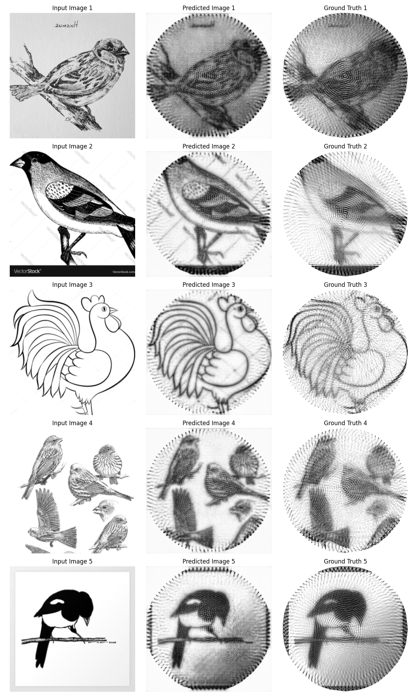

# U-Net

## Motivation

Although the U-Net architecture was originally designed for image segmentation tasks, it proved to be a good fit for the **StringArt** problem. U-Net's ability to generate output images with the same shape as the input, along with its skip connections preserving important spatial details, makes it well-suited for this task.

## Model Architecture


> Original U-Net Architecture

The only modification from the original U-Net design is a reduced-depth convolutional path. Instead of the standard 1024 → 512 → 256 → 128 → 64 configuration, a lighter version was used:
256 → 128 → 64 → 32 → 16.

This change was made because the original architecture struggled to generalize effectively on the relatively small training set of 1000 images.

## Image Preprocessing 

Images are scaled to the `[0, 1]` range by dividing pixel values by 255.

All other preprocessing steps are handled by the [Procedural Computing of String Art](https://github.com/skpha13/Procedural-Computing-of-String-Art/tree/main/docs) Python package.

More information on data generation: [Data Pipeline](./01_data_pipeline.md)

Image Information:

- **Input Shape**: 256x256
- **Channels**: 1 (grayscale)
- **Output Shape**: 256x256
 
## Training Setup

### Loss Function

Initially, **MSE (Mean Squared Error)** was used as the loss function. However, it failed to capture the structural patterns of StringArt, especially the peg layout and line connections (drawing a line from one peg to another).


Some images had the circular cropping; others did not. Peg and line placement was inconsistent.

To better capture the structural similarity between images, [SSIM (Structural Similarity Index)](https://www.cns.nyu.edu/~lcv/ssim/) was used.


> Images with the same MSE can look vastly different. SSIM highlights this discrepancy.

```python
from piqa import SSIM

class SSIMLoss(SSIM):
    def __init__(self, **kwargs):
        super().__init__(**kwargs)

    def forward(self, x, y):
        return 1. - super().forward(x, y)
```

Using the `piqa` package, a custom SSIM loss function was implemented. Since SSIM returns values from -1 to 1 (with -1 perfect anti-correlation, 0 no similarity and 1 being perfect similarity), we subtract it from 1 to treat it as a proper loss value, lower is better.


> Noticeably better structure. Circular layouts are respected even if lines are still imperfect.

### Optimizer

- **Optimizer**: AdamW
- **Learning Rate**: 1e-4

### Learning Rate Scheduler 

A "ReduceLROnPlateau" scheduler was used, with:
- Factor: 0.5 (halves the learning rate when triggered)
- Patience: 10 epochs without validation loss improvement.

### Batch Size and Accumulation Steps

Due to GPU limitations (Tesla T4 on Kaggle), a small batch size of **16** was used.
To simulate a larger batch size and stabilize training, **gradient accumulation** of 4 was used (Simulated Batch Size = 4*16 = 64).

## Results

### Training vs Validation Loss


Both training and validation losses decrease together, indicating healthy learning. However, validation loss plateaus around **0.55**, while training loss continues down to **~0.5**.

This suggests that we may have reached the limits of what U-Net alone can achieve. Further improvements may require more advanced architectures or techniques.

### Predictions



- **Pros**:
    - Circular peg patterns are well-replicated.
    - Outputs are visually close to the ground truth.

- **Cons**:
    - Line-drawing logic (connecting pegs) is not well learned.
    - Some pegs are misaligned or missing.
