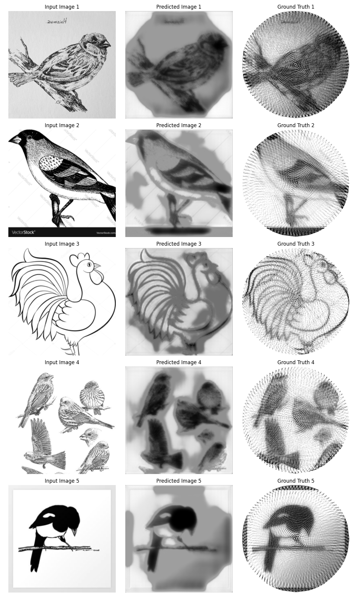
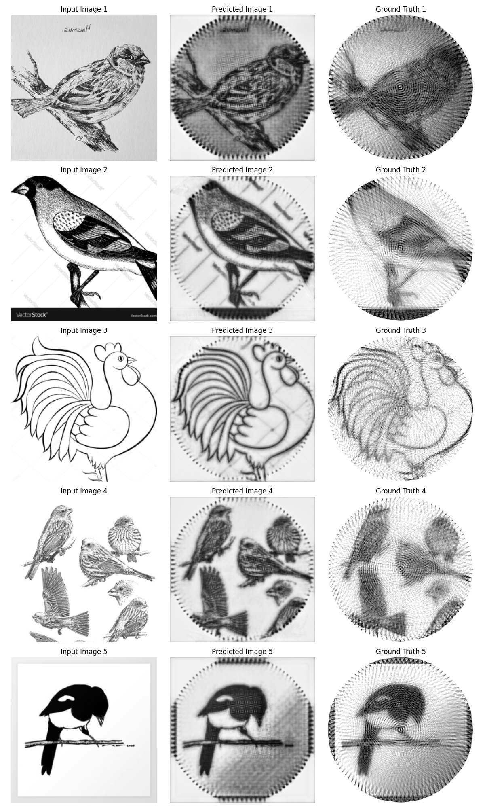
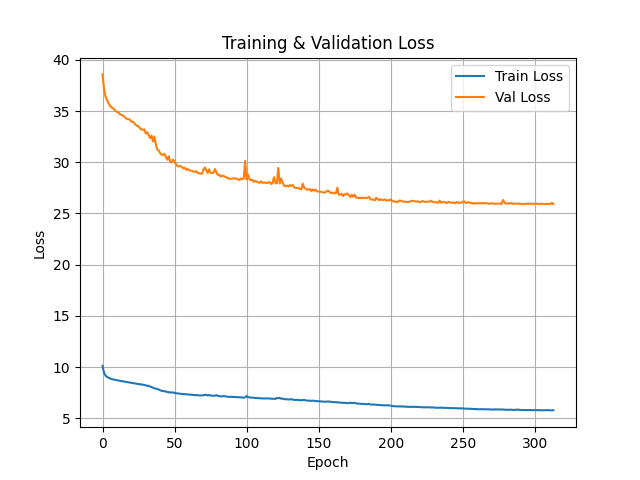
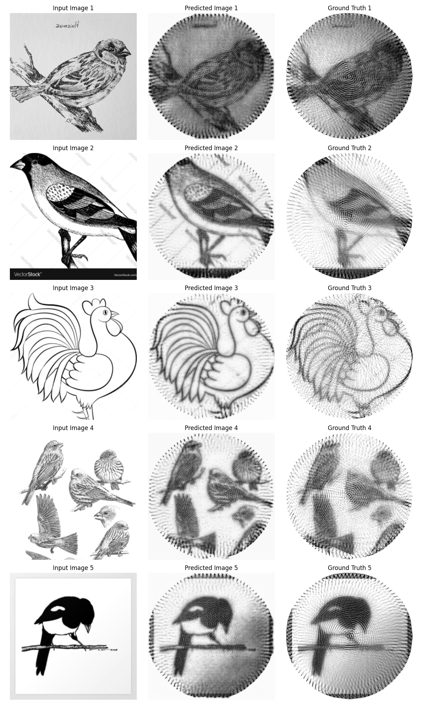

# Generative adversarial network (GAN) Using U-Net Generator

## Motivation

GANs are known for their ability to generate realistic images. Based on this, I hypothesized that a GAN architecture could learn the structural patterns of string art and generate corresponding outputs for given input images.

## Model Architecture

### Generator

The generator is the same [U-Net model](02_unet_model.md) previously used, with no modifications or additions.

### Discriminator

The discriminator is a fully convolutional network comprising three convolutional layers with feature sizes of 64, 128, and 256, respectively:

```python
class PatchDiscriminator(nn.Module):
    def __init__(self, in_channels=2):
        # 2 in_channels, one for real and one for generated
        super().__init__()

        self.model = nn.Sequential(
            nn.Conv2d(in_channels, 64, 4, 2, 1),
            nn.LeakyReLU(),
            nn.Conv2d(64, 128, 4, 2, 1),
            nn.BatchNorm2d(128),
            nn.LeakyReLU(),
            nn.Conv2d(128, 1, 4, 1, 1),
            nn.Sigmoid(),
        )

    def forward(self, x, y):
        # x: input image, y: real or generated output image
        return self.model(torch.cat([x, y], dim=1))
```

## Image Preprocessing

The same preprocessing pipeline from the [U-Net#image-preprocessing](./02_unet_model.md#image-preprocessing) model was used. 

## Loss Function

As observed during the [U-Net#loss-function](./02_unet_model.md#loss-function) experiments, the Structural Similarity Index Measure (SSIM) loss performs significantly better at preserving structural features compared to Mean Squared Error (MSE) loss:

### MSE 



### SSIM



The final loss function combines:
- A Binary Cross-Entropy (BCE) loss between the discriminator's prediction for generated images and their true label (fake)
- Plus an SSIM loss encouraging pixel-wise similarity between the generated image and the ground truth.

The total loss can be expressed as:

```math
Loss = Loss_{discriminator} + \lambda * Loss_{SSIM}
```

Where:
- λ is a coefficient controlling the balance between realism (fooling the discriminator) and accuracy (structural similarity to the label image).
- λ value was chosen to be `50` for this training setup.

## Optimizations

### Batch Size and Accumulation Steps

The same as [U-Net#batch-size-and-accumulation-steps](./02_unet_model.md#batch-size-and-accumulation-steps)

### Learning Rate Scheduler

A "ReduceLROnPlateau" scheduler was used, with:
- Factor: 0.5 (halves the learning rate when triggered)
- Patience: 10 epochs without validation loss improvement.

### Early Stopping and Model Checkpoint

Custom logic was implemented to:
- Early stop training if no improvements are observed over 20 consecutive epochs.
- Checkpoint and save the model whenever a new best validation loss is achieved.

## Results

### Training vs Validation Loss



Training was stopped at approximately the 300th epoch by early stopping. Both training and validation losses show a steady and correlated decrease until convergence.

### Predictions



The generated predictions closely match those produced by the base U-Net model. Further comparative analysis between the GAN and U-Net outputs needs to be done.